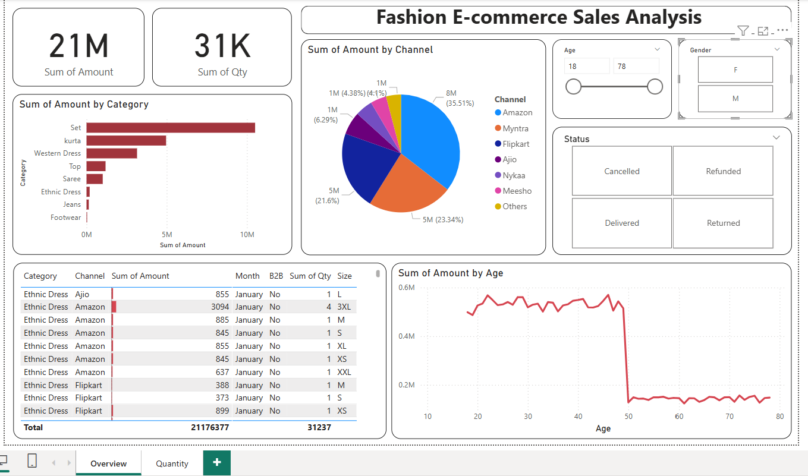
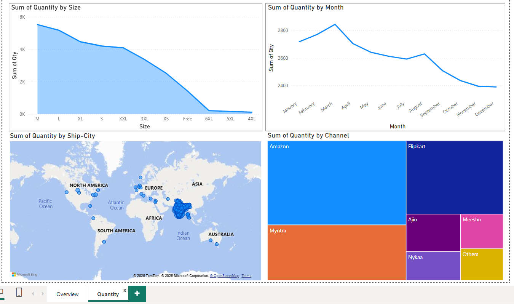

# Fashion-E-Commerce-Sales-Analysis-
# 📊 Phân Tích Doanh Số Thời Trang Trên Nền Tảng Thương Mại Điện Tử

## Giới thiệu

Dự án làm việc nhóm của học phần **Trực quan hoá dữ liệu (Data Visualization)**

Dự án này phân tích doanh số bán hàng trong ngành thời trang từ nhiều nền tảng thương mại điện tử khác nhau như Amazon, Flipkart, Myntra, Ajio, Nykaa, Meesho, v.v. Báo cáo được xây dựng bằng Power BI, nhằm trực quan hóa các chỉ số kinh doanh và hiểu rõ xu hướng mua sắm theo thời gian, theo giới tính, nền tảng và loại sản phẩm.

## Dữ liệu

File dữ liệu gốc: `Fashion_Sales_Analysis.xlsx`

**Các cột dữ liệu chính:**

- `Order ID`, `Cust ID`: định danh đơn hàng và khách hàng
- `Gender`, `Age`: thông tin người mua
- `Date`: ngày đặt hàng
- `Status`: trạng thái đơn hàng (Delivered, Cancelled, Returned, Refunded)
- `Channel`: nền tảng thương mại điện tử (Amazon, Flipkart, v.v.)
- `Category`: loại sản phẩm (quần jean, váy, giày dép, sari,...)
- `Qty`, `Amount`: số lượng và tổng số tiền đơn hàng
- `Ship-city`, `Ship-state`: địa chỉ giao hàng

## Mục tiêu phân tích

- Tổng doanh số và số lượng bán ra theo từng danh mục sản phẩm
- Phân tích doanh thu theo nền tảng bán hàng
- Thống kê số đơn hàng theo trạng thái
- Xu hướng mua sắm theo giới tính và độ tuổi khách hàng
- Xu hướng mua sắm theo từng tháng/quý

## Dashboard

Báo cáo Power BI gồm nhiều biểu đồ tương tác như:

- Biểu đồ cột: Doanh thu theo danh mục sản phẩm
- Biểu đồ tròn: Tỷ lệ đơn hàng theo trạng thái
- Slicer lọc theo nền tảng và giới tính
- Biểu đồ đường: Xu hướng doanh số theo thời gian

📷 Ảnh minh họa từ dashboard:

## 🛠 Công cụ sử dụng

- **Power BI Desktop**: Xử lý và trực quan hóa dữ liệu

## Thành viên

Dự án được thực hiện theo nhóm. 
Vai trò cá nhân: xây dựng phần trực quan hóa và trình bày số liệu chính trên Power BI.

## Kết quả

- Tăng cường kỹ năng sử dụng Power BI để trình bày báo cáo
- Thành thạo biểu đồ cơ bản, slicer và bộ lọc.
- Biết cách phân tích dữ liệu.

## File đính kèm

- `Fashion_Sales_Analysis.xlsx`: dữ liệu gốc
- `Project_PowerBI.pbix`: file Dashboard Power BI
- `Project_Report.pdf`: file báo cáo project
---

